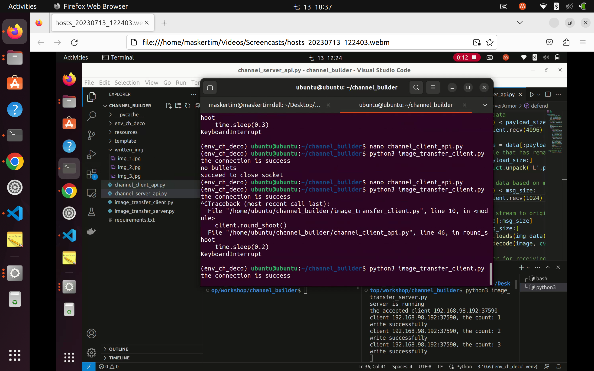
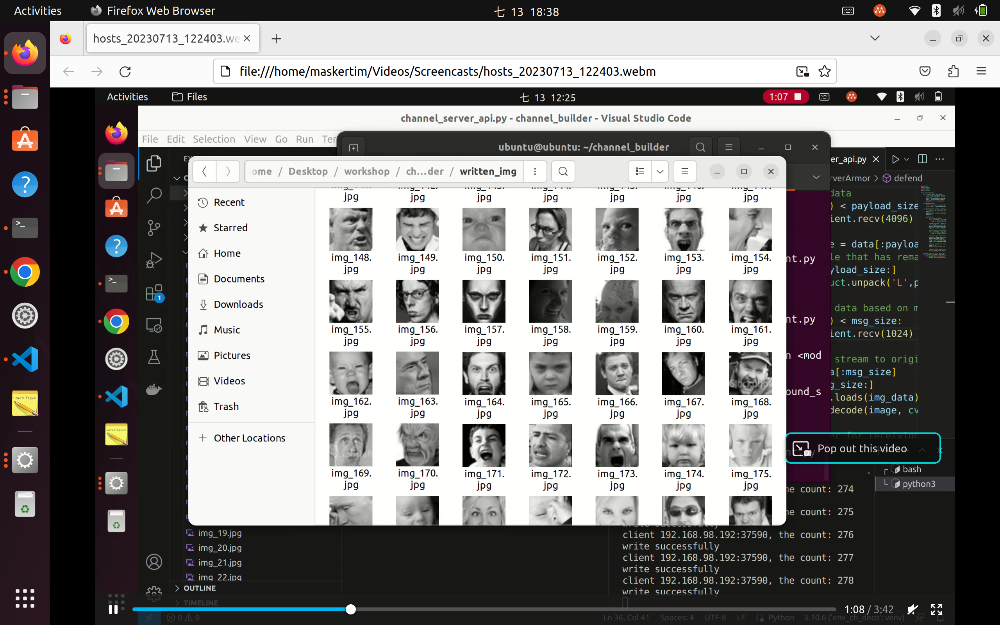
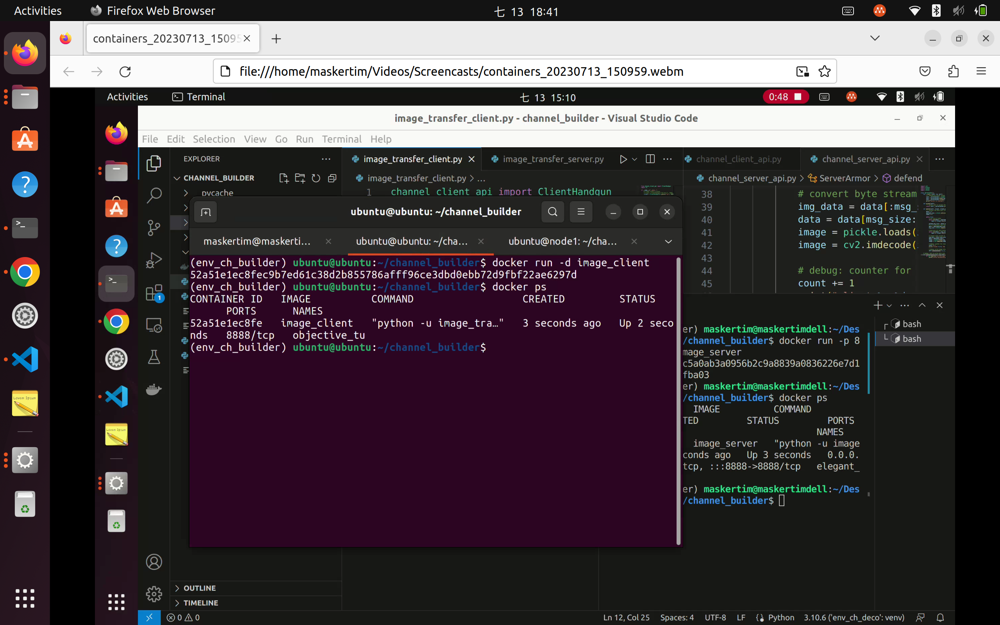
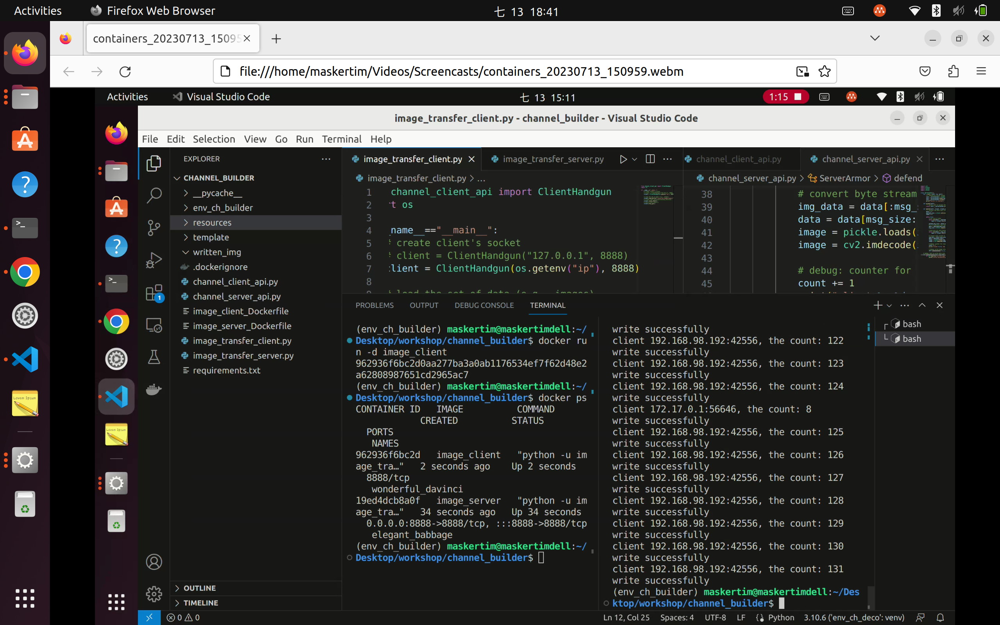
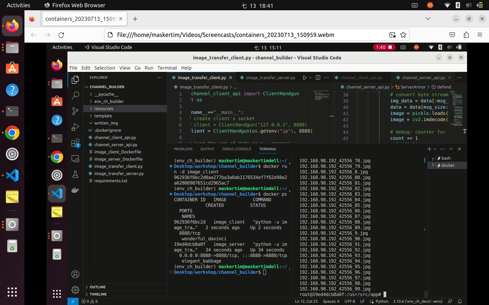

# Image Transfer Code
This is a sample code for image transfer from client to server.

## Prerequistes
* Python
* Docker

## How to Start it
### Easy to start
1. Firstly, please install the dependency packages by `pip install -r requirements.txt`
2. You need to customize to setup the client and server address.
3. And please setup your directory path of images in `load_bullet(data)`.
4. `shoot` is that the program sends the data on your control.

### Container requirement
If you would like to run the program in a container. There is the dockerfiles `image_client_Dockerfile` and `image_server_Dockerfile` for client and server, respectively.

1. Please first to build the dockerfile into image. The example of command: `docker build -f image_client_Dockerfile -t {tag name/image name} .`.

2. And then start the container. e.g., `docker run -p 8888:8888 -d {image name:tag}`

### Debug functions
* In the `channel_server_api.py`, the function `__write_file` is for debugging, so if you don't use this function, you can remove or comment it.
* The `written_img` directory is the place where `__write_file` writes the image files.

## Running Snapshot
Transfer the images between host and raspberry pi (OS: ubuntu 22.04).
* Running without container

* Running with container

